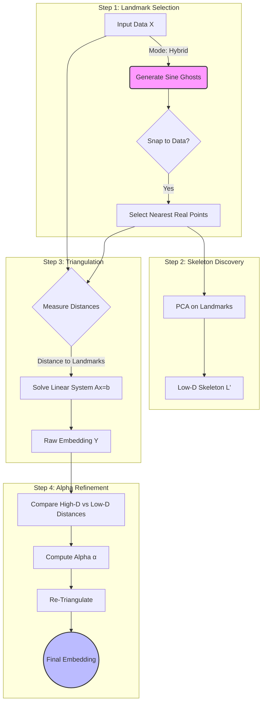

# Landmark Triangulation

[](https://www.python.org/downloads/)
[](https://opensource.org/licenses/MIT)

> **A deterministic, linear-time alternative to t-SNE for dimensionality reduction.**

**Landmark Triangulation** is a dimensionality reduction algorithm designed for speed, stability, and massive scalability. Unlike t-SNE or UMAP, which rely on iterative optimization and O(N²) pairwise comparisons, this method uses **landmark triangulation** against a topological skeleton to map points in **O(N·k)** linear time.

This approach makes it possible to generate embeddings for millions of points in seconds, without needing a GPU.

📖 **Read the Full Story:** [A Linear-Time Alternative To t-SNE for Dimensionality Reduction and Fast Visualisation](https://medium.com/towards-artificial-intelligence/a-linear-time-alternative-to-t-sne-for-dimensionality-reduction-and-fast-visualisation-5cd1a7219d6f)

---

## ⚡ Benchmarks

Comparison against Scikit-Learn's t-SNE on a synthetic dataset of 2,000 samples with 5 clusters (50 features):

| Method          | Time (sec) | Speedup | Silhouette Score |
|-----------------|-----------:|--------:|-----------------:|
| Random Mode     |      0.25s |     84x |             0.81 |
| Synthetic Mode  |      0.25s |     84x |             0.33 |
| Hybrid Mode     |      0.21s |    100x |             0.61 |
| t-SNE           |     21.16s |      1x |             0.84 |

**Key Takeaways:**
- 🚀 **~85× faster** than t-SNE on this dataset
- 🎯 **96% of t-SNE's clustering quality** (0.81 vs 0.84 score) in a fraction of the time


📊 Reproduce this benchmark with the notebook in the `examples/` folder.

---

## 🚀 Key Features

- **⚡ Linear Time Complexity O(N·k)**: Scales linearly with dataset size
- **🎯 Deterministic & Stable**: No random initialization that changes results between runs
- **🔧 Scikit-learn Compatible**: Drop-in replacement for TSNE/UMAP in existing pipelines
- **📐 Alpha Refinement**: Global stress-correction to minimize distortion
- **👻 Ghost Manifolds (Hybrid Mode)**: Novel "Manifold Snapping" technique that fits a sine-wave skeleton to your data distribution

---

## 📦 Installation

Installation instructions are provided using `uv`, but standard `pip` commands work as well.

```bash
# Clone the repository
git clone https://github.com/thngbk/LandmarkTriangulation.git
cd LandmarkTriangulation

# Create virtual environment and activate it (optional)
uv venv

# Activate it
source .venv/bin/activate  # On Windows: .venv\Scripts\activate

# Install package in editable mode with dev dependencies
uv pip install -e .

# Or with development dependencies
pip install -e ".[dev]"
```

### Dependencies

- Python ≥ 3.8
- NumPy ≥ 1.20.0
- Scikit-learn ≥ 1.0.0

---

## 💻 Quick Start

### Basic Usage

Landmark Triangulation provides a scikit-learn-compatible transformer:

```python
import numpy as np
from landmark_triangulation import LandmarkTriangulation

# Generate sample high-dimensional data
X = np.random.rand(10000, 50)  # 10k samples, 50 features

# Initialize transformer (hybrid mode recommended)
transformer = LandmarkTriangulation(
    n_components=2, 
    n_landmarks=150, 
    landmark_mode='hybrid',
    random_state=42
)

# Fit and transform in linear time
embedding = transformer.fit_transform(X)

print(f"Embedding shape: {embedding.shape}")  
# Output: (10000, 2)
```

### Scikit-learn Pipeline Integration

```python
from sklearn.pipeline import Pipeline
from sklearn.preprocessing import StandardScaler
from landmark_triangulation import LandmarkTriangulation

pipeline = Pipeline([
    ('scaler', StandardScaler()),
    ('reducer', LandmarkTriangulation(n_components=2, n_landmarks=100))
])

X_embedded = pipeline.fit_transform(X)
```

### Visualization Example

```python
import matplotlib.pyplot as plt
from sklearn.datasets import make_swiss_roll

# Generate Swiss roll dataset
X, color = make_swiss_roll(n_samples=2000, noise=0.1, random_state=42)

# Apply Landmark Triangulation
lt = LandmarkTriangulation(n_components=2, n_landmarks=100, landmark_mode='hybrid')
X_embedded = lt.fit_transform(X)

# Plot results
plt.figure(figsize=(10, 5))

plt.subplot(121)
plt.scatter(X[:, 0], X[:, 2], c=color, cmap='viridis', s=10)
plt.title('Original Swiss Roll')
plt.xlabel('X')
plt.ylabel('Z')

plt.subplot(122)
plt.scatter(X_embedded[:, 0], X_embedded[:, 1], c=color, cmap='viridis', s=10)
plt.title('Landmark Triangulation Embedding')
plt.xlabel('Component 1')
plt.ylabel('Component 2')

plt.tight_layout()
plt.show()
```

---

## 🧠 How It Works

This algorithm acts like a **GPS system** rather than preserving all pairwise distances:

1. **Landmark Selection**: Select k "satellite" points (landmarks) from your data
2. **Skeleton Discovery**: Use PCA on landmarks to determine global structure
3. **Triangulation**: For each point, measure distances to landmarks and solve a linear system to find 2D coordinates
4. **Alpha Correction**: Calculate global error factor α and re-run triangulation to minimize distortion



### Landmark Selection Strategies

| Mode            | Description                                                                          | Best For                           | Performance       |
|-----------------|--------------------------------------------------------------------------------------|------------------------------------|-------------------|
| **`random`**    | Randomly selects k points from your dataset                                          | General purpose, dense clusters    | ⭐⭐⭐⭐⭐ (Best)  |
| **`synthetic`** | Generates a perfect sine-wave path through phase space                               | Visualizing theoretical manifolds  | ⭐⭐⭐            |
| **`hybrid`**    | **(Recommended)** Generates sine-wave "ghosts" and snaps them to nearest real points | Preserving topology with real data | ⭐⭐⭐⭐          |

```python
# Recommended: Hybrid mode for most use cases
transformer = LandmarkTriangulation(
    n_components=2,
    n_landmarks=100,        # More landmarks = better accuracy but slower
    landmark_mode='hybrid',
    random_state=42         # For reproducibility
)
```

---

## 📂 Repository Structure

```
landmark-triangulation/
├── src/
│   └── landmark_triangulation/
│       ├── __init__.py         # Package exports
│       ├── _version.py         # Version info
│       ├── core.py             # Main implementation
│       └── py.typed            # Type hints marker
├── tests/                      # Unit tests
│   ├── conftest.py              # Shared fixtures
│   ├── test_core.py             # Core functionality tests
│   ├── test_sklearn_compatibility.py  # Scikit-learn API tests
│   ├── test_numerical_stability.py    # Numerical correctness
│   └── test_performance.py      # Performance tests (marked @slow)
├── examples/                   # Jupyter notebooks
│   └── tsne_benchmark.ipynb
├── resources/
│   └── images/                 # Benchmark plots
├── pyproject.toml              # Build configuration
├── README.md
├── CHANGELOG.rst
└── LICENSE
```

---

## 🤝 Contributing

Contributions are welcome! Please feel free to submit a Pull Request. For major changes:

1. Fork the repository
2. Create your feature branch (`git checkout -b feature/AmazingFeature`)
3. Run tests (`pytest`)
4. Format code (`ruff format && ruff check --fix`)
5. Commit changes (`git commit -m 'Add some AmazingFeature'`)
6. Push to branch (`git push origin feature/AmazingFeature`)
7. Open a Pull Request

---

## 🧪 Testing

This project uses `pytest` for testing with high code coverage standards.

### Running Tests

```bash
# Install with dev dependencies
uv pip install -e ".[dev]"

# Run all tests (excludes slow performance tests by default)
uv run pytest

# Run with coverage report
uv run pytest --cov=landmark_triangulation --cov-report=html

# Run ALL tests including slow performance tests
uv run pytest -m ""

# Run only fast tests explicitly
uv run pytest -m "not slow"

# Run specific test file
uv run pytest tests/test_core.py

# Run with verbose output
uv run pytest -v
```

### Test Coverage

View the HTML coverage report:

```bash
# Generate report
uv run pytest --cov=landmark_triangulation --cov-report=html

# Open in browser (Linux/Mac)
open htmlcov/index.html
```

---

## 📝 Citation

If you use this package in your research, please cite:

```bibtex
@misc{ferrando2025slr_article,
  author       = {Ferrando-Llopis, Roman},
  title        = {A Linear-Time Alternative To t-SNE for Dimensionality Reduction and Fast Visualisation},
  year         = 2025,
  publisher    = {Zenodo},
  doi          = {10.5281/zenodo.18007950},
  url          = {https://doi.org/10.5281/zenodo.18007950}
}
```

---

## 📄 License

This project is licensed under the MIT License - see the [LICENSE](LICENSE) file for details.

---

## 📮 Contact & Support

- **Issues**: [GitHub Issues](https://github.com/thngbk/LandmarkTriangulation/issues)
- **Discussions**: [GitHub Discussions](https://github.com/thngbk/LandmarkTriangulation/discussions)
- **Article**: [Medium Post](https://medium.com/towards-artificial-intelligence/a-linear-time-alternative-to-t-sne-for-dimensionality-reduction-and-fast-visualisation-5cd1a7219d6f)
