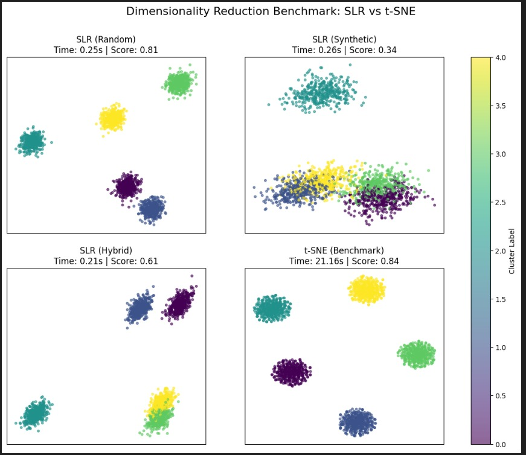
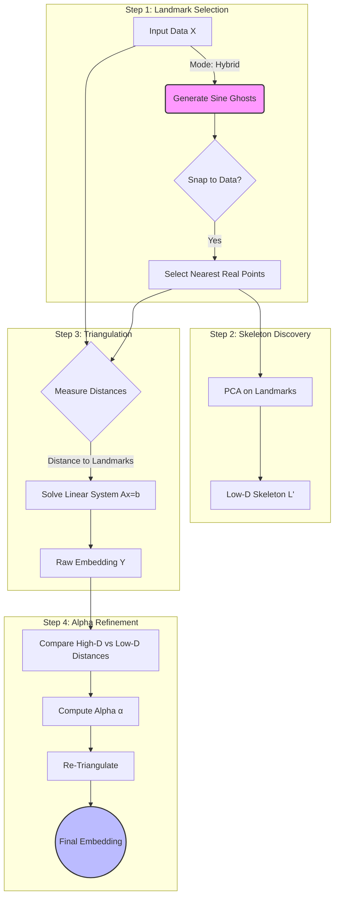

# SLR: Sine Landmark Reduction

> **A deterministic, linear-time alternative to t-SNE for dimensionality reduction.**

**SLR** (implemented here as `LandmarkTriangulation`) is a dimensionality reduction algorithm designed for speed, stability, and massive scalability. Unlike t-SNE or UMAP, which rely on iterative optimization and O(N^2) pairwise comparisons, SLR uses **landmark triangulation** against a topological skeleton to map points in **O(N)** linear time.

This approach makes it possible to generate embeddings for millions of points in seconds, without needing a GPU.

📖 **Read the Full Story:** [A Linear-Time Alternative To t-SNE for Dimensionality Reduction and Fast Visualisation](https://medium.com/towards-artificial-intelligence/a-linear-time-alternative-to-t-sne-for-dimensionality-reduction-and-fast-visualisation-5cd1a7219d6f)

---
## ⚡ Benchmarks
We compared SLR against Scikit-Learn's TSNE implementation on a synthetic dataset of 2,000 samples with 5 clusters (50 features).

| Method        | Time (sec) | Speedup | Silhouette Score |
|--------------|-----------:|--------:|-----------------:|
| SLR (Random) |      0.25s |     84x |             0.81 |
| SLR (Synthetic) |      0.25s |    84x |             0.33 |
| SLR (Hybrid) |      0.21s |    100x |             0.61 |
| t-SNE        |     21.16s |      1x |             0.84 |

 - Speed: SLR is approximately 85x faster than t-SNE on this dataset.
 - Quality: SLR (Random Mode) achieves 96% of t-SNE's clustering quality (0.81 vs 0.84 score) in a fraction of the time.




To reproduce this benchmark, please check examples/ folder

---

## 🚀 Key Features

* **⚡ Linear Time Complexity O(N \cdot k):** Scales linearly with dataset size. The runtime for 1 million samples is roughly 10x the runtime for 100k samples.
* **🎯 Deterministic & Stable:** No random initialization seeds that change your results every run. If the data is the same, the embedding is the same.
* **📐 Alpha Refinement:** A global stress-correction step that automatically adjusts the scale of the embedding to minimize distortion.
* **Ghost Manifolds (Hybrid Mode):** A novel "Manifold Snapping" technique that fits a sine-wave skeleton to your real data distribution, ensuring theoretical coverage without hallucinating empty space.

---

## 📦 Installation

```bash
# Clone the repository
git clone https://github.com/thngbk/LandmarkTriangulation.git
cd LandmarkTriangulation

# Install dependencies
pip install -r requirements.txt

# Install the package
pip install .

```

---

## 💻 Quick Start

SLR provides a Scikit-Learn compatible transformer: `LandmarkTriangulation`.

```python
import numpy as np
from landmark_triangulation import LandmarkTriangulation

# 1. Generate some dummy high-dimensional data
X = np.random.rand(10000, 50)  # 10k samples, 50 features

# 2. Initialize SLR
# 'hybrid' mode combines the structure of sine waves with real data points
slr = LandmarkTriangulation(
    n_components=2, 
    n_landmarks=150, 
    landmark_mode='hybrid'
)

# 3. Fit and Transform (Linear Time)
embedding = slr.fit_transform(X)

print(f"Embedding shape: {embedding.shape}") 
# Output: (10000, 2)

```

---

## 🧠 How It Works

SLR does not attempt to preserve *all* pairwise distances (which is slow). Instead, it acts like a **GPS system**:

1. **Landmark Selection:** The algorithm selects k "satellite" points (landmarks).
2. **Skeleton Discovery:** It computes the PCA structure of just these k landmarks to determine the global shape.
3. **Triangulation:** For every data point x, it measures the distance to the landmarks. It then solves a linear system (Ax=b) to find the coordinates in 2D space that best preserve those distances.
4. **Alpha Correction:** It calculates a global error factor \alpha (the mismatch between High-D and Low-D scales) and re-runs the triangulation to minimize stress.




### Landmark Modes

The power of SLR lies in how it chooses landmarks. You can control this via `landmark_mode`:

| Mode | Description | Best For |
| --- | --- | --- |
| **`'random'`** | Selects k points randomly from your dataset. | General purpose, dense clusters. |
| **`'synthetic'`** | Generates a perfect sine-wave path through the phase space. Ignores data distribution. | Visualizing theoretical manifolds or gaps. |
| **`'hybrid'`** | **(Recommended)** Generates a sine-wave "ghost" path, then *snaps* each ghost to the nearest real data point. | Preserving topology while ensuring landmarks exist in reality. |

```python
# Use the Hybrid Snap strategy (Best of both worlds)
slr = LandmarkTriangulation(landmark_mode='hybrid')

```

---

## 📂 Repository Structure

```text
.
├── data/                 # Store your CSVs here 
├── examples/             # Jupyter notebooks showing usage
│   └── t-SNE Benchmark.ipynb
├── scripts/              # Helper scripts for data generation
├── src/
│   └── landmark_triangulation/
│       ├── __init__.py
│       └── core.py       # The main implementation
├── tests/                # Unit tests
├── README.md
├── LICENSE
└── pyproject.toml

```

---

## 📝 Citation

If you use SLR in your research or production visualization, please cite the original article:

```bibtex

@misc{ferrando2025slr_article,
  author       = {Ferrando-Llopis, Roman},
  title        = {A Linear-Time Alternative To t-SNE for Dimensionality Reduction and Fast Visualisation},
  year         = 2025,
  publisher    = {Zenodo},
  doi          = {10.5281/zenodo.18007950},
  url          = {https://doi.org/10.5281/zenodo.18007950}
}

```

## 📄 License

This project is licensed under the MIT License - see the [LICENSE](LICENSE) file for details.
